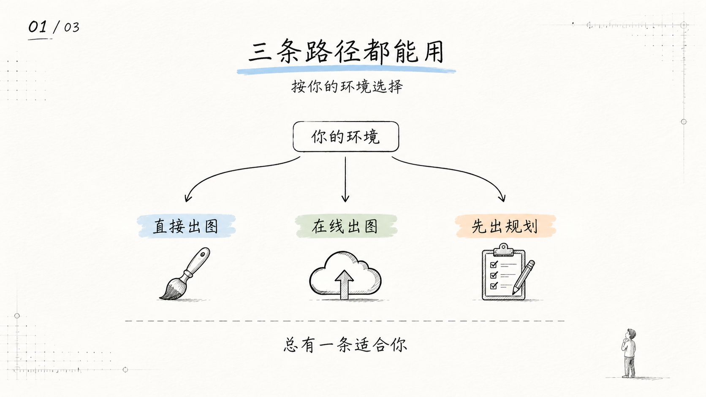
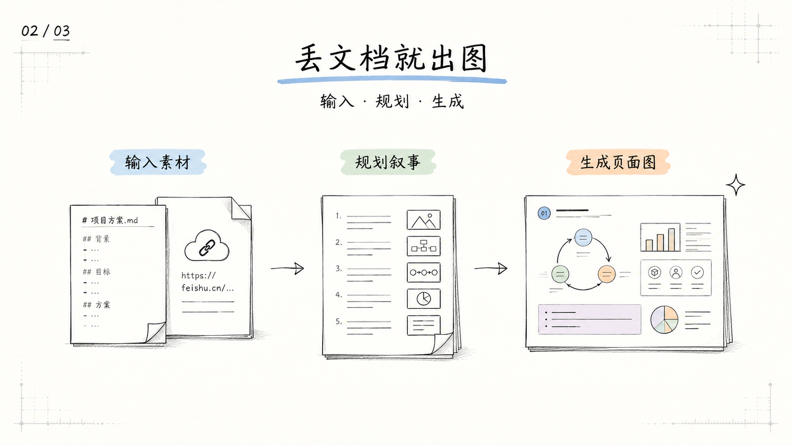
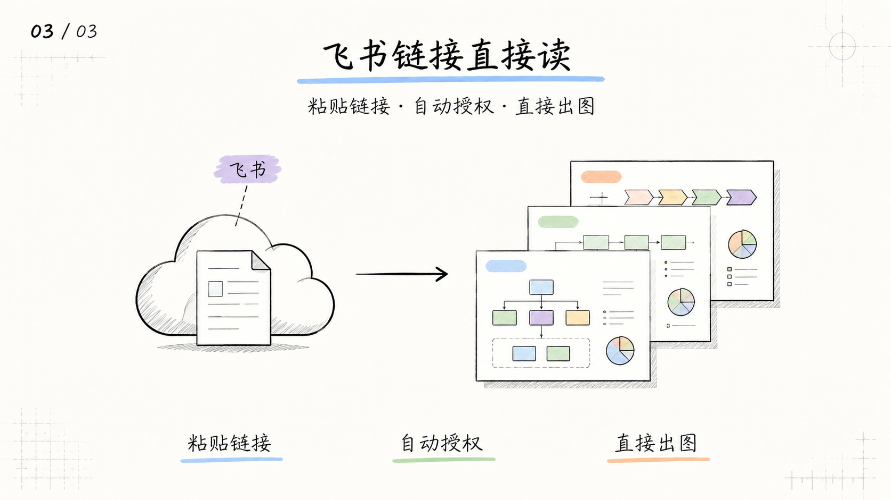

<p align="center">
  
</p>

# doc-to-sketch

doc-to-sketch 是一个把文档内容转换为**中文手绘技术解释图**的 AI Skill。

常见场景：文章封面 + 正文配图 · 课程/训练营解释图 · 长文先规划再出图

主要产出是 PNG 页面图（无生图能力时先输出 blueprint + prompts）。支持 Markdown、DOCX、PDF、PPTX、纯文本和飞书文档 URL 作为输入。

---

## 开始使用

### 安装

```bash
npx skills add statefulai/doc-to-sketch
```

CLI 会检测已安装的 agent（Claude Code、Codex、Cursor、Cline 等），选择目标即可。全局安装加 `-g -y`。

不确定当前环境能做什么？进入安装后的 skill 目录运行自检（通常是 `~/.agents/skills/doc-to-sketch`）：

```bash
cd ~/.agents/skills/doc-to-sketch && bash scripts/doctor.sh
```

### 按你的路径开始

| 路径 | 适用宿主 | 第一句话 |
|------|----------|----------|
| 🎨 Path A | Codex、Claude Code（原生出图） | `Use $doc-to-sketch 把这篇文章做成 1 张封面图 + 3 张正文配图。` |
| 🔧 Path B | Cursor、Cline 等（配置了 IMAGE_API） | `Use $doc-to-sketch 把这篇文章做成图文 deck，用 fallback 生成图片。` |
| 📋 Path C | 所有支持 Skills 的 agent | `Use $doc-to-sketch 帮我规划一套中文手绘技术图的 blueprint。` |

- **Path A**：宿主有原生图像生成，直接输出 PNG 页面图 + contact sheet。
- **Path B**：宿主没有原生生图，但配置了 `IMAGE_API_KEY` + `IMAGE_API_URL`（见 `.env.example`），skill 会询问后通过外部 API 生成。
- **Path C**：无生图能力也无 API 配置，输出完整 blueprint + 每页可直接粘贴到 ChatGPT/Midjourney 的 prompt 文件。

### 更多 prompt 示例

```text
# 课程课件
Use $doc-to-sketch 把这份课程大纲整理成 8 页中文手绘技术课件图。
面向有基础的新手，每页一个核心概念。

# 只规划，不生图
Use $doc-to-sketch 先不要生图。
请把这篇内容规划成一套 10 页左右的中文手绘技术图 deck。
每页给出标题、主旨、版式 archetype、可见文字和图像 brief。

# 飞书文档
Use $doc-to-sketch 把这篇飞书文档做成 1 张封面图 + 4 张正文配图。
https://xxx.feishu.cn/docx/xxxxx
```

完整示例见 [examples/prompts.md](examples/prompts.md)。

---

## 示例效果

以下为 doc-to-sketch 正文配图实际输出（16:9）：





视觉特征：近白纸底、无边框、细手绘线条、淡色标记、中央图小而精、大量留白、中文短少可检查。

---

## 输入与边界

**支持的输入**：Markdown、DOCX、PDF、PPTX、纯文本、飞书 docx/wiki URL

**输出**（取决于路径）：
- Path A/B：21:9 封面图 + 16:9 正文配图 + contact sheet + blueprint 摘要
- Path C：结构化 blueprint + 每页 ready-to-use prompt 文件

**不输出**：可编辑 PPTX、PDF、Keynote、HTML/SVG/canvas

**注意**：
- 图片里中文越短越稳定，每页建议多生几次择优
- AI 图像模型可能出现错字、风格漂移，不要默认第一张就是终稿
- PPTX/PDF 可以作为输入读取，但不是输出格式

---

## 进阶配置

### 图像生成 fallback（Path B）

配置后 skill 可通过外部 API 生成图片：

```bash
export IMAGE_API_KEY=your_api_key          # 如 "Bearer sk-xxx" 或 "sk-xxx"
export IMAGE_API_URL=https://api.example.com/v1/images/generations
export IMAGE_MODEL=gpt-image-2             # 可选
```

手动调用：

```bash
scripts/generate_image.sh --prompt-file prompt.txt --size 1920x1080 --output-dir output/
```

> ⚠️ prompt 内容会发送到你配置的第三方服务。

### 飞书文档读取

首次使用飞书 URL 时，skill 会自动打开浏览器完成 OAuth 授权。也可以提前预授权：

```bash
python3 scripts/feishu_fetch.py auth
```

默认使用共享飞书应用完成零配置授权。权限范围：`docx:document:readonly`、`wiki:wiki:readonly`、`offline_access`（仅用于刷新 token）。不申请任何写权限。token 仅保存在本机 `~/.doc-to-sketch/token.json`，不上传。

企业或敏感场景建议使用自建飞书应用，详见 `.env.example`。

### 备选安装方式

```bash
git clone https://github.com/statefulai/doc-to-sketch.git
cd doc-to-sketch

# Codex
ln -s "$(pwd)" "${CODEX_HOME:-$HOME/.codex}/skills/doc-to-sketch"

# Claude Code
ln -s "$(pwd)" ~/.claude/skills/doc-to-sketch
```

### 目录结构

```text
.
├── SKILL.md                    ← Skill 定义入口
├── references/                 ← prompt 资产（叙事、版式、视觉、质量）
├── assets/                     ← 风格锚点图 + theme tokens
├── scripts/
│   ├── feishu_fetch.py         ← 飞书文档获取
│   ├── generate_image.sh       ← 图像生成 fallback
│   └── doctor.sh               ← 配置自检
├── examples/
│   ├── images/                 ← 示例输出
│   └── prompts.md              ← prompt 示例
├── .env.example                ← 环境变量模板
└── README.md
```

---

## 致谢

视觉 DNA、叙事规划系统和 prompt 模板基于 **Ian** 的 [ian-handdrawn-ppt](https://github.com/helloianneo/ian-handdrawn-ppt)。

## License

MIT License. See [LICENSE](LICENSE).
