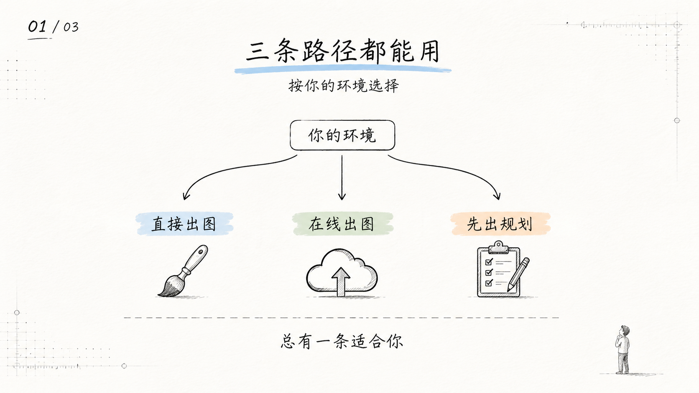
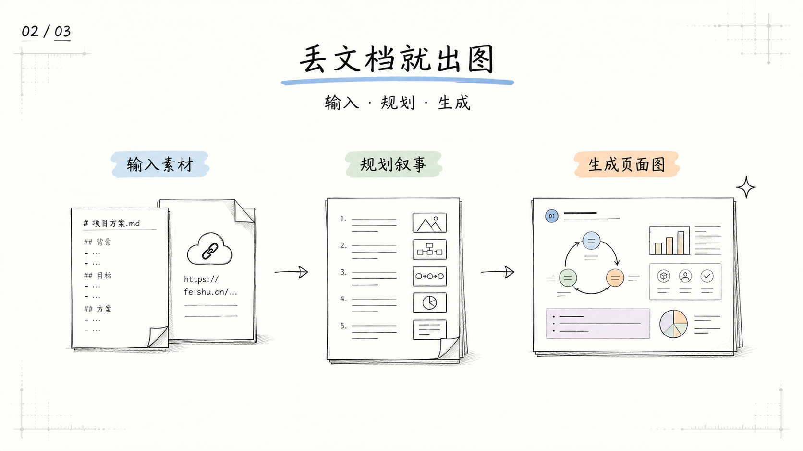
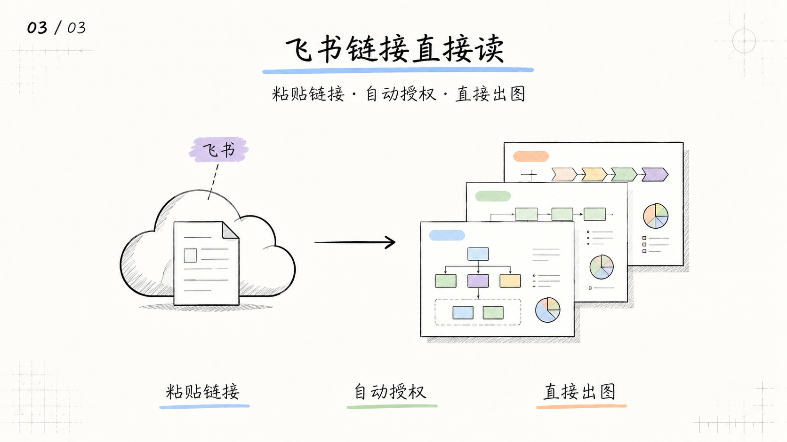
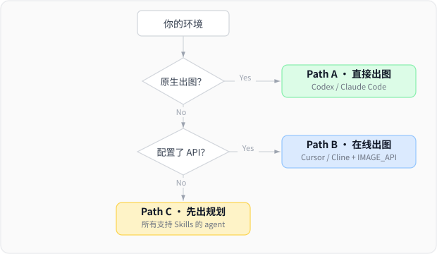

<p align="center">
  
</p>

# doc-to-sketch

doc-to-sketch 是一个把文档内容转换为**中文手绘技术解释图**的 AI Skill。

常见场景：文章封面 + 正文配图 · 课程/训练营解释图 · 长文先规划再出图 · 网站列表小图

主要产出是 PNG 页面图（无生图能力时先输出 blueprint + prompts）。支持 Markdown、DOCX、PDF、PPTX、纯文本和飞书文档 URL 作为输入。

## 示例效果

以下为 doc-to-sketch 正文配图实际输出（16:9）：





视觉特征：近白纸底、无边框、细手绘线条、淡色标记、中央图小而精、大量留白、中文短少可检查。

## 快速开始

### 安装

```bash
npx skills add statefulai/doc-to-sketch
```

CLI 会检测已安装的 agent（Claude Code、Codex、Cursor、Cline 等），选择目标即可。全局安装加 `-g -y`。

不确定当前环境能做什么？进入安装后的 skill 目录运行自检（通常是 `~/.agents/skills/doc-to-sketch`）：

```bash
cd ~/.agents/skills/doc-to-sketch && bash scripts/doctor.sh
```

### 按你的路径开始



- **Path A** 直接出图 → `Use $doc-to-sketch 把这篇文章做成 1 张封面图 + 3 张正文配图。`
  有人值守且宿主有原生图像生成（Codex、Claude Code）时，直接输出 PNG 页面图 + contact sheet。
- **Path B** 在线出图 → `Use $doc-to-sketch 把这篇文章做成图文 deck，用 fallback 生成图片。`
  已配置 `IMAGE_API_KEY` + `IMAGE_API_URL`（见 `.env.example`）时，通过外部 API 生成。有人值守时需先确认；无人值守时只允许此生图路径。
- **Path C** 先出规划 → `Use $doc-to-sketch 帮我规划一套中文手绘技术图的 blueprint。`
  没有可用生图路径时输出完整 blueprint + 每页可直接粘贴到 ChatGPT/Midjourney 的 prompt 文件；无人值守且未配置 API 时，即使宿主能原生生图也走此路径。

完整示例见 [examples/prompts.md](examples/prompts.md)。

## 输入与输出

**支持的输入**：Markdown、DOCX、PDF、PPTX、纯文本、飞书 docx/wiki URL

**输出**（取决于路径）：
- Path A/B：21:9 封面图 + 16:9 正文配图 + contact sheet + blueprint 摘要
- Path C：结构化 blueprint + 每页 ready-to-use prompt 文件

**不输出**：可编辑 PPTX、PDF、Keynote、HTML/SVG/canvas

**注意**：
- 图片里中文越短越稳定，每页建议多生几次择优
- AI 图像模型可能出现错字、风格漂移，不要默认第一张就是终稿
- PPTX/PDF 可以作为输入读取，但不是输出格式

## 列表小图

给网站列表里的每一条（作品、文章、生活记录或任意列表）配一张方形小图。

- 「用 doc-to-sketch 给这篇文章画一张列表小图。」后面附正文、链接或标题加一句话。
- 「给『读书地图』画一张小图，紫色放在图钉上。」
- 「按我网站的风格档再出 6 张。」

同一站点的所有小图共用一份风格档 `tile-style.json`。它放在站点项目里，颜色、尺寸、张数和风格锁都写在这份文件里，换一个站点就换一份。项目里还没有风格档时，skill 会先问你颜色和显示尺寸，不会直接套用示例。[examples/tile-style.example.json](examples/tile-style.example.json) 是一个已定稿站点的真实风格档，可以复制后改成自己的。

产出在 `output/tiles/<slug>/`：几张候选图，外加一张对照图 `candidate-review.png`，把每张候选放在浅色、深色两种背景下比较。选定的那张复制为 `source.png`。

## 特色功能

### 飞书文档读取

首次使用飞书 URL 时，skill 会自动打开浏览器完成 OAuth 授权。也可以提前预授权：

```bash
python3 scripts/feishu_fetch.py auth
```

默认使用共享飞书应用完成零配置授权。权限范围：`docx:document:readonly`、`wiki:wiki:readonly`、`offline_access`（仅用于刷新 token）。不申请任何写权限。token 仅保存在本机 `~/.doc-to-sketch/token.json`，不上传。

企业或敏感场景建议使用自建飞书应用，详见 `.env.example`。

### 图像生成 fallback（Path B）

配置后 skill 可通过外部 API 生成图片：

```bash
export IMAGE_API_KEY=your_api_key          # 如 "Bearer sk-xxx" 或 "sk-xxx"
export IMAGE_API_URL=https://api.example.com/v1/images/generations
export IMAGE_MODEL=gpt-image-2             # 可选
```

手动调用：

```bash
scripts/generate_image.sh --prompt-file prompt.txt --size 1920x1080 --output-dir output/
```

> ⚠️ prompt 内容会发送到你配置的第三方服务。

### 无人值守模式（可选）

运营方可在宿主环境预先授权并设定单次任务上限：同时设置 `DOC_TO_SKETCH_UNATTENDED=1`、正整数 `DOC_TO_SKETCH_MAX_IMAGES` 和任务共用的 `DOC_TO_SKETCH_RUN_DIR`。Agent 不得自行设置这三个变量。缺少前两个变量之一时维持有人值守行为，Path B 调用前仍需明确确认；已启用无人值守却缺少 `DOC_TO_SKETCH_RUN_DIR` 时拒绝生图。无人值守时，即使宿主有原生生图能力也不用 Path A：只通过 Path B 脚本出图；未配置外部 API 则走 Path C。Path B 使用任务目录下的共用计数文件，即使图片写入不同输出目录也受同一上限约束；超出上限的页面交付 prompt。

本地计数与租约只防止误用，不构成安全或硬成本边界：Agent 可以改动自身进程环境。硬预算必须由运营方在服务商侧设置，使用专用图片 API key，并为该 key 配置消费或速率上限。

Path B 在有人值守和无人值守模式下每次成功出图，都会在输出目录追加 `sketch-receipt.jsonl`；调用时可用 `--required-text-file` 传入每页必需文字清单（JSON 字符串数组或每行一条）。回执中的 `output_file` 相对输出目录，另含图片哈希及 `pending_cross_audit` 状态。无人值守图片必须经过逐张交叉审计，审计通过前均为“待交叉审计”。

## 参考

### 备选安装方式

```bash
git clone https://github.com/statefulai/doc-to-sketch.git
cd doc-to-sketch

# Codex
ln -s "$(pwd)" "${CODEX_HOME:-$HOME/.codex}/skills/doc-to-sketch"

# Claude Code
ln -s "$(pwd)" ~/.claude/skills/doc-to-sketch
```

### 目录结构

```text
.
├── SKILL.md                    ← Skill 定义入口
├── references/                 ← prompt 资产（叙事、版式、视觉、质量）
├── assets/                     ← 风格锚点图 + theme tokens + 列表小图基础风格
├── scripts/
│   ├── feishu_fetch.py         ← 飞书文档获取
│   ├── generate_image.sh       ← 图像生成 fallback
│   ├── tile_review.py          ← 列表小图对照
│   └── doctor.sh               ← 配置自检
├── examples/
│   ├── images/                 ← 示例输出
│   ├── prompts.md              ← prompt 示例
│   └── tile-style.example.json ← 列表小图示例风格档
├── .env.example                ← 环境变量模板
└── README.md
```

## 致谢

视觉 DNA、叙事规划系统和 prompt 模板基于 **Ian** 的 [ian-handdrawn-ppt](https://github.com/helloianneo/ian-handdrawn-ppt)。

## License

MIT License. See [LICENSE](LICENSE).
